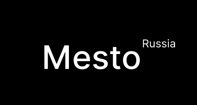

# Mesto

<p align='center'></p>


Mesto - это учебный проект, разработка которого помогла мне познакомиться с адаптивной веб-вёрсткой и разработкой без использования сторонних фреймворков и крупных библиотек. Проект представляет собой интерфейс ленты фотографий, где пользователи могут регистрироваться, загружать карточки, ставить лайки и изменять данные своего профиля.

## Установка

Для запуска проекта склонируйте репозиторий и установите зависимости, используя npm:

```
git clone https://github.com/bvbsis/mesto-project.git
cd mesto-project
npm install
```

## Использование

Для запуска проекта в режиме разработки используйте следующую команду:

```
npm run dev
```

Для сборки проекта используйте следующую команду:

```
npm run build
```

Для развертывания проекта на GitHub Pages используйте следующую команду:

```
npm run deploy
```

## Зависимости

Проект использует следующие зависимости:

- **@babel/core**: 7.15.8
- **@babel/preset-env**: 7.15.8
- **autoprefixer**: 10.4.0
- **babel-loader**: 8.2.3
- **clean-webpack-plugin**: 4.0.0
- **css-loader**: 6.5.0
- **cssnano**: 5.0.8
- **gh-pages**: 3.2.3
- **html-webpack-plugin**: 5.5.0
- **mini-css-extract-plugin**: 2.4.3
- **postcss-loader**: 6.2.0
- **webpack**: 5.60.0
- **webpack-cli**: 4.9.1
- **webpack-dev-server**: 4.4.0
- **core-js**: 3.19.0


## Что добавить в будущем

* Комментарии к карточкам. Пользователи смогут оставлять комментарии к карточкам, которые они загрузили.

* Поиск. Пользователи смогут искать карточки по ключевым словам или тегам.

* Сортировку. Пользователи смогут сортировать карточки по дате загрузки или количеству лайков.


## Ссылка на демо проекта
 https://bvbsis.github.io/mesto-project/index.html
